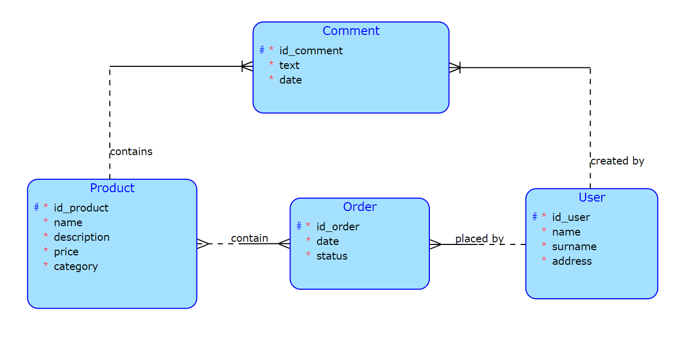

# Online grocery store

## Description

The project is online store where users can order products and leave comments on products' pages.

## Conceptual model

## Business operation

- **User registration and authentication**: Users can create accounts, log in and edit their information
- **Adding products to cart**: Users can add products to a cart
- **Order placement and tracking**: Users can place orders and track their status
- **Product comments**: Users can leave comments to products and read comments from other users
- **Product and order management**: Administrators have access to edit products' information, add new products, remove comments and process orders 

# Complex query

- **Select products with a certain category**: `SELECT id_product FROM Product WHERE category='some_category'`
